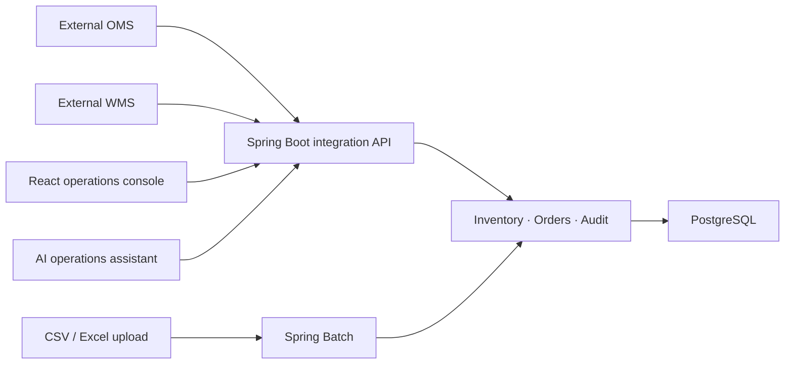

# FORME Operations Hub

F&F 디지털본부 Java/Spring ERP·AI 시스템 직무를 목표로 설계한 글로벌 패션 주문·재고 통합 운영 플랫폼입니다. 고객용 이커머스인 [FORME](https://github.com/khp9798/forme-fashion-commerce)는 그대로 유지하고, 이 프로젝트는 사내 직원이 여러 브랜드·채널·창고의 업무를 처리하는 독립 시스템으로 개발합니다.

## 목표

- Spring Boot 기반 REST API와 React·TypeScript 운영 화면
- 창고·매장·SKU별 재고 및 모든 이동 원장
- 외부 OMS·WMS·ERP 데이터를 받는 대량 배치와 실패 재처리
- 역할별 권한, 승인 흐름과 관리자 감사 로그
- 업무 매뉴얼 RAG와 안전한 AI 조회 도구
- PostgreSQL·Docker·CI/CD·모니터링을 포함한 운영 가능한 구조

## 아키텍처 원칙

처음부터 마이크로서비스로 나누지 않고 **모듈형 모놀리스**로 시작합니다. 주문 연동, 재고, 배치, 감사처럼 업무 경계는 코드에서 분리하지만 하나의 애플리케이션과 트랜잭션으로 개발 복잡도를 낮춥니다. 규모와 조직이 커져 독립 배포가 필요한 모듈만 나중에 분리할 수 있습니다.



## 현재 구현

- Java 21, Spring Boot 4.1, Gradle
- React 19, TypeScript, Vite
- PostgreSQL 17 개발 컨테이너
- Flyway 초기 스키마: 창고, 상품, SKU, 재고 포지션, 재고 원장, 연동 작업
- Actuator와 시스템 정보 REST API
- 운영 대시보드 첫 화면
- 백엔드·프론트엔드 GitHub Actions 검증
- 창고·상품·SKU 검색 및 창고별 가용 재고 조회 API
- 입고·조정·예약·해제·파손 재고 이동과 변경 원장
- 행 잠금과 멱등성 키를 이용한 동시 요청·중복 요청 보호
- PostgreSQL 사용자·역할, BCrypt 비밀번호, HttpOnly 서버 세션 기반 운영자 인증
- CSRF 토큰으로 보호되는 로그인·재고 변경·로그아웃 요청
- 로그인과 세션 복구를 중앙 관리하는 React 인증 컨텍스트
- 실제 PostgreSQL API에 연결된 반응형 재고 조회·조정 화면
- Testcontainers PostgreSQL에서 실행되는 동시 예약·중복 요청 통합 테스트
- 외부 주문 CSV 양식 다운로드, 드래그앤드롭 업로드 및 행 단위 검증 화면
- 주문 파일·검증 결과·원본 행을 보존하는 PostgreSQL 스테이징 구조
- SKU 존재 여부, 주문일시, 수량·단가, 통화, 배송 필수값, 파일 내 중복 검증
- 실제 PostgreSQL에 정상·오류 행과 오류 사유를 함께 저장하는 주문 통합 테스트

## 로컬 실행

```bash
cp .env.example .env
docker compose up -d postgres

cd backend
JAVA_HOME="$(brew --prefix openjdk@21)" ./gradlew bootRun

cd ../frontend
npm install
npm run dev
```

- API: `http://localhost:8080/api/v1/system/info`
- Health: `http://localhost:8080/actuator/health`
- Web: `http://localhost:5173`

개발용 운영 계정은 `ops-admin` / `forme-local-admin`입니다. 비밀번호는 Flyway 로컬 시드에서 BCrypt 해시로만 저장됩니다. PostgreSQL은 Mac에 설치된 DB와 충돌하지 않도록 기본적으로 `5433` 포트를 사용합니다.

인증 후 브라우저에는 비밀번호 대신 HttpOnly `JSESSIONID` 쿠키가 저장됩니다. 세션은 기본 30분이며 상태 변경 요청은 CSRF 토큰이 필요합니다. 재고 API는 `OPERATOR` 또는 `ADMIN` 역할만 접근할 수 있습니다.

## 재고 API

```bash
# 세션·CSRF 흐름은 React 화면에서 자동 처리합니다.
open http://localhost:5173

# 백엔드 전체 테스트 + 실제 PostgreSQL 동시성 통합 테스트
cd backend
JAVA_HOME="$(brew --prefix openjdk@21)" ./gradlew test
```

`idempotencyKey`가 같은 요청을 다시 보내면 재고를 또 차감하지 않고 최초 처리 결과를 돌려줍니다. 재고 행은 변경하는 동안 잠가 동시에 여러 요청이 들어와도 수량 검증과 변경이 한 줄로 처리됩니다.

## 외부 주문 CSV 검증

운영 화면의 `주문 통합`에서 표준 CSV 양식을 내려받고 파일을 업로드할 수 있습니다. `POST /api/v1/order-imports/validate`는 최대 5MB·5,000행을 받으며 다음 항목을 처리 전에 확인합니다.

- 헤더와 UTF-8 CSV 형식
- 활성 SKU 존재 여부
- ISO-8601 주문일시와 양수 수량·가격
- 영문 3자리 통화 코드와 배송 필수값
- 동일 파일 안의 주문번호·SKU 중복

검증이 일부 실패해도 파일 전체를 버리지 않습니다. `integration_jobs`에는 파일 단위 합계와 상태를, `order_import_rows`에는 각 원본 행과 `VALID`/`INVALID`, 오류 사유를 저장합니다. 덕분에 운영자는 실패 위치를 찾을 수 있고, 다음 Spring Batch 단계는 정상 행만 골라 안전하게 처리할 수 있습니다.

## 다음 구현 순서

1. Spring Batch 청크 처리·실패 격리·재시작
2. 역할 기반 승인·감사 로그
3. 판매·재고 집계 및 SQL 튜닝
4. RAG 기반 업무 매뉴얼과 AI 조회 도구
