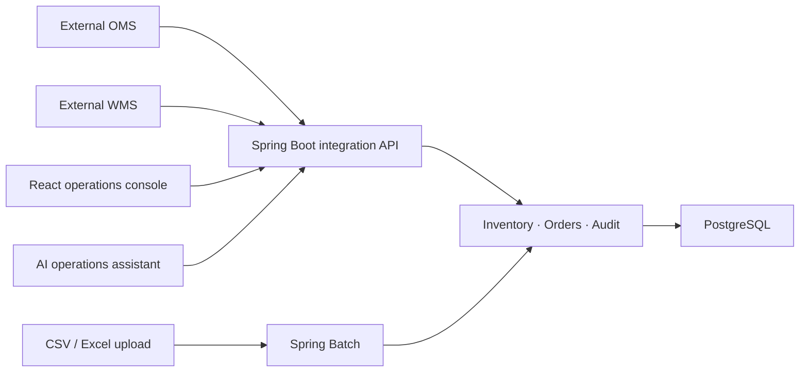

# FORME Operations Hub

F&F 디지털본부 Java/Spring ERP·AI 시스템 직무를 목표로 설계한 글로벌 패션 주문·재고 통합 운영 플랫폼입니다. 고객용 이커머스인 [FORME](https://github.com/khp9798/forme-fashion-commerce)는 그대로 유지하고, 이 프로젝트는 사내 직원이 여러 브랜드·채널·창고의 업무를 처리하는 독립 시스템으로 개발합니다.

## 목표

- Spring Boot 기반 REST API와 React·TypeScript 운영 화면
- 창고·매장·SKU별 재고 및 모든 이동 원장
- 외부 OMS·WMS·ERP 데이터를 받는 대량 배치와 실패 재처리
- 역할별 권한, 승인 흐름과 관리자 감사 로그
- 업무 매뉴얼 RAG와 안전한 AI 조회 도구
- PostgreSQL·Docker·CI/CD·모니터링을 포함한 운영 가능한 구조

## 아키텍처 원칙

처음부터 마이크로서비스로 나누지 않고 **모듈형 모놀리스**로 시작합니다. 주문 연동, 재고, 배치, 감사처럼 업무 경계는 코드에서 분리하지만 하나의 애플리케이션과 트랜잭션으로 개발 복잡도를 낮춥니다. 규모와 조직이 커져 독립 배포가 필요한 모듈만 나중에 분리할 수 있습니다.



## 현재 구현

- Java 21, Spring Boot 4.1, Gradle
- React 19, TypeScript, Vite
- PostgreSQL 17 개발 컨테이너
- Flyway 초기 스키마: 창고, 상품, SKU, 재고 포지션, 재고 원장, 연동 작업
- Actuator와 시스템 정보 REST API
- 운영 대시보드 첫 화면
- 백엔드·프론트엔드 GitHub Actions 검증
- 창고·상품·SKU 검색 및 창고별 가용 재고 조회 API
- 입고·조정·예약·해제·파손 재고 이동과 변경 원장
- 행 잠금과 멱등성 키를 이용한 동시 요청·중복 요청 보호
- PostgreSQL 사용자·역할, BCrypt 비밀번호, HttpOnly 서버 세션 기반 운영자 인증
- CSRF 토큰으로 보호되는 로그인·재고 변경·로그아웃 요청
- 로그인과 세션 복구를 중앙 관리하는 React 인증 컨텍스트
- 실제 PostgreSQL API에 연결된 반응형 재고 조회·조정 화면
- Testcontainers PostgreSQL에서 실행되는 동시 예약·중복 요청 통합 테스트
- 외부 주문 CSV 양식 다운로드, 드래그앤드롭 업로드 및 행 단위 검증 화면
- 주문 파일·검증 결과·원본 행을 보존하는 PostgreSQL 스테이징 구조
- SKU 존재 여부, 주문일시, 수량·단가, 통화, 배송 필수값, 파일 내 중복 검증
- 실제 PostgreSQL에 정상·오류 행과 오류 사유를 함께 저장하는 주문 통합 테스트
- Spring Batch 6 기반 100행 청크 주문 처리와 실행 메타데이터
- 검증 정상 행만 실제 주문·주문상품으로 이동하고 오류 행은 스테이징에 격리
- 처리 완료 행을 제외하는 재실행과 DB UNIQUE 제약을 통한 중복 주문 방지
- 재고 조정 요청과 승인·거절 워크플로우
- 요청자와 승인자를 분리하는 직무 분리 및 역할 기반 API 접근 제어
- 승인된 요청만 기존 재고 잠금·멱등성 로직으로 반영하는 단일 트랜잭션
- 담당자·시각·행위·요청 ID를 추적하는 감사 로그 조회 화면
- 날짜·SKU·유입 채널별 판매 집계 테이블과 관리자 갱신 API
- 판매량·매출·가용 재고·판매 소진율을 결합한 분석 화면
- 고정 읽기 전용 SQL의 PostgreSQL `EXPLAIN ANALYZE` 성능 비교
- 매시 정각 판매 집계를 실행하는 Spring 스케줄러와 관리자 수동 실행 API
- `RUNNING`·`COMPLETED`·`FAILED` 실행 이력, 실패 원인과 재시도 계보 관리
- PostgreSQL 부분 UNIQUE 인덱스로 막는 다중 서버 간 동일 배치 중복 실행
- 관리자 실패 재시도·상태 필터와 모바일 대응 배치 운영 화면
- 실제 주문과 분리된 1만~50만 행 SQL 성능 비교 샘플 생성
- 동일 데이터의 인덱스 미적용·복합 커버링 인덱스 적용 `EXPLAIN ANALYZE` 비교

## 로컬 실행

```bash
cp .env.example .env
docker compose up -d postgres

cd backend
JAVA_HOME="$(brew --prefix openjdk@21)" ./gradlew bootRun

cd ../frontend
npm install
npm run dev
```

- API: `http://localhost:8080/api/v1/system/info`
- Health: `http://localhost:8080/actuator/health`
- Web: `http://localhost:5173`

개발용 운영 계정은 `ops-admin` / `forme-local-admin`, 승인 계정은 `ops-approver` / `forme-local-admin`입니다. 비밀번호는 Flyway 로컬 시드에서 BCrypt 해시로만 저장됩니다. PostgreSQL은 Mac에 설치된 DB와 충돌하지 않도록 기본적으로 `5433` 포트를 사용합니다.

인증 후 브라우저에는 비밀번호 대신 HttpOnly `JSESSIONID` 쿠키가 저장됩니다. 세션은 기본 30분이며 상태 변경 요청은 CSRF 토큰이 필요합니다. 재고 API는 `OPERATOR` 또는 `ADMIN` 역할만 접근할 수 있습니다.

## 백엔드 패키지와 데이터 접근 원칙

최상위는 `orderimport`, `inventory`, `approval`, `operationsbatch`, `analytics`, `audit`, `auth`처럼 업무 기능별로 나눕니다. 각 기능 안에서 Controller는 HTTP, Service는 업무 흐름과 트랜잭션, Repository는 `JdbcTemplate` SQL과 결과 매핑을 담당합니다. 일반 Service에는 SQL 문자열을 두지 않아 업무 순서가 데이터 접근 구현에 가려지지 않게 했습니다.

Spring Batch의 `OrderImportBatchConfiguration` Reader와 `OrderImportItemWriter`는 청크 읽기·쓰기 자체가 책임인 배치 인프라 구성 요소라 `JdbcTemplate` 사용을 유지합니다. 모든 클래스를 형식적으로 Repository로 감싸기보다 변경 책임이 실제로 분리되는 곳에만 계층을 적용합니다.

## 재고 API

```bash
# 세션·CSRF 흐름은 React 화면에서 자동 처리합니다.
open http://localhost:5173

# 백엔드 전체 테스트 + 실제 PostgreSQL 동시성 통합 테스트
cd backend
JAVA_HOME="$(brew --prefix openjdk@21)" ./gradlew test
```

`idempotencyKey`가 같은 요청을 다시 보내면 재고를 또 차감하지 않고 최초 처리 결과를 돌려줍니다. 재고 행은 변경하는 동안 잠가 동시에 여러 요청이 들어와도 수량 검증과 변경이 한 줄로 처리됩니다.

## 외부 주문 CSV 검증

운영 화면의 `주문 통합`에서 표준 CSV 양식을 내려받고 파일을 업로드할 수 있습니다. `POST /api/v1/order-imports/validate`는 최대 5MB·5,000행을 받으며 다음 항목을 처리 전에 확인합니다.

- 헤더와 UTF-8 CSV 형식
- 활성 SKU 존재 여부
- ISO-8601 주문일시와 양수 수량·가격
- 영문 3자리 통화 코드와 배송 필수값
- 동일 파일 안의 주문번호·SKU 중복

검증이 일부 실패해도 파일 전체를 버리지 않습니다. `integration_jobs`에는 파일 단위 합계와 상태를, `order_import_rows`에는 각 원본 행과 `VALID`/`INVALID`, 오류 사유를 저장합니다. 덕분에 운영자는 실패 위치를 찾을 수 있고, 다음 Spring Batch 단계는 정상 행만 골라 안전하게 처리할 수 있습니다.

## Spring Batch 주문 처리

검증 결과 화면의 `정상 주문 배치 실행`은 `VALID`이면서 아직 처리되지 않은 행만 읽어 100행씩 하나의 트랜잭션으로 처리합니다. 주문 헤더는 `external_orders`, SKU별 상품은 `external_order_items`에 저장하고 원본 행은 `PROCESSED`로 바뀝니다.

Spring Batch 실행·Step·읽기·쓰기·커밋 정보는 Flyway가 만든 배치 메타데이터 테이블에 기록됩니다. 실행 중 장애가 나도 이미 커밋된 청크는 `PROCESSED`라 다음 실행에서 제외됩니다. 같은 파일 작업을 다시 실행해도 읽기·쓰기 0건이며, 외부 주문번호와 주문·SKU UNIQUE 제약이 중복 저장을 한 번 더 방어합니다.

## 재고 승인과 감사 로그

운영자는 `재고 관리`에서 수량을 바로 변경하지 않고 조정 요청을 만듭니다. 요청은 `PENDING` 상태로 저장되며 실제 재고는 그대로 유지됩니다. `APPROVER` 또는 `ADMIN` 역할의 다른 사용자가 `승인 업무`에서 검토한 뒤 승인해야만 기존 재고 이동 서비스가 실행됩니다.

요청자와 승인자가 같으면 서버가 거절합니다. 승인 처리에서는 요청 행을 `FOR UPDATE`로 잠가 두 명이 동시에 같은 요청을 처리하지 못하게 하고, 재고 변경·승인 상태·감사 로그를 하나의 트랜잭션으로 묶습니다. 따라서 재고 반영에 실패하면 승인 기록만 남는 불일치도 생기지 않습니다. 거절할 때는 사유가 필수이며 재고는 변경하지 않습니다.

`audit_logs`에는 요청과 승인·거절마다 담당자, 행위, 대상 요청 ID, 요약, 시각을 기록합니다. 요청 ID가 같아 한 업무의 시작과 결과를 연결해서 추적할 수 있습니다.

## 판매·재고 집계와 SQL 분석

대시보드 요청마다 `external_orders`와 `external_order_items` 전체를 조인·합산하지 않습니다. `daily_sku_sales`는 날짜·SKU·유입 시스템별 주문상품 수, 판매 수량, 매출을 미리 계산하고, `daily_channel_sales`는 여러 SKU가 들어간 주문도 전체 주문 수가 중복되지 않도록 날짜·채널별 합계를 별도로 보관합니다.

분석 모듈은 `SalesAnalyticsService`와 `SalesAnalyticsRepository`로 책임을 나눕니다. Service는 기간 검증, 트랜잭션과 처리 순서, 응답 조립을 담당하고 Repository는 PostgreSQL SQL, 잠금, 감사 로그 저장과 조회 결과 변환을 담당합니다. 따라서 업무 흐름을 읽을 때 긴 SQL에 가리지 않고, 데이터 접근 방식이 바뀌어도 Service의 변경 범위를 줄일 수 있습니다.

관리자가 집계를 갱신할 때 같은 날짜 범위를 지우고 원본 주문에서 다시 계산하므로 재실행해도 중복되지 않습니다. PostgreSQL advisory lock으로 동시에 두 번 갱신되는 것도 막고, 갱신 담당자와 범위·결과 행 수는 감사 로그에 남깁니다. 일반 운영자는 결과를 조회할 수 있지만 집계 갱신은 `ADMIN`만 실행할 수 있습니다.

`SQL 실행계획 비교`는 사용자가 SQL을 직접 입력하는 기능이 아닙니다. 서버에 고정한 원본 조인 쿼리와 일별 집계 쿼리에만 `EXPLAIN (ANALYZE, BUFFERS)`를 실행해 계획 시간, 실행 시간과 실행계획 원문을 보여줍니다. 현재 로컬 3개 주문에서는 원본 0.228ms, 집계 0.053ms였지만 데이터와 캐시 상태에 따라 달라지므로 절대 성능 수치가 아니라 구조 비교 자료로 사용합니다.

## 운영 배치와 실패 재처리

`operational_batch_jobs`는 작업명, 실행 주기, 실제 처리기를 정의하고 `operational_batch_executions`는 자동·수동·재시도 실행을 매번 새 행으로 기록합니다. 작업 시작을 먼저 별도 트랜잭션으로 저장하므로 실제 집계 트랜잭션이 실패해 롤백되어도 실패 원인과 실행 시각은 사라지지 않습니다.

같은 작업의 `RUNNING` 행은 하나만 존재하도록 PostgreSQL 부분 UNIQUE 인덱스를 사용합니다. 따라서 애플리케이션 서버가 여러 대가 되어도 동시에 같은 집계를 시작하지 못합니다. 실패 재시도는 기존 행을 덮어쓰지 않고 새 실행을 만들며 `retry_of`로 최초 실패와 연결합니다. 최대 재시도 횟수를 넘기거나 완료된 실행을 다시 시도하면 서버가 거절합니다.

판매 집계는 Asia/Seoul 기준 매시 정각 자동 실행되고 관리자는 운영 화면에서 즉시 수동 실행할 수 있습니다. 운영자와 승인자는 이력을 읽을 수 있지만 실행·재시도는 `ADMIN`만 가능합니다. 테스트 환경에서는 스케줄러를 꺼 테스트가 시간에 따라 달라지지 않게 합니다.

## 대량 데이터와 인덱스 성능 비교

운영 데이터에 가짜 주문을 섞지 않도록 `sales_query_benchmark_heap`과 `sales_query_benchmark_indexed`라는 전용 테이블을 사용합니다. 관리자는 PostgreSQL `generate_series`로 1만~50만 행을 만들 수 있으며 동일한 행을 두 테이블에 복제합니다. 첫 테이블에는 조회용 인덱스가 없고, 두 번째 테이블에는 `(ordered_at, sku_code) INCLUDE (quantity, gross_amount)` 복합 커버링 인덱스가 있습니다.

동일한 기간·SKU 매출 집계 SQL을 양쪽에 `EXPLAIN (ANALYZE, BUFFERS)`로 실행해 계획 시간, 실행 시간과 실행계획 원문을 비교합니다. 커버링 인덱스는 검색 조건과 결과 계산에 필요한 열을 함께 가지고 있어 조건에 맞는 경우 원본 테이블을 다시 읽는 비용을 줄일 수 있습니다. 반대로 조회 기간이 전체 데이터 대부분을 포함하면 순차 스캔이 더 효율적일 수 있으므로 “인덱스는 항상 빠르다”라고 가정하지 않고 직접 측정합니다.

로컬 10만 행·최근 30일 기준 확인에서는 인덱스 미적용 14.893ms, 적용 2.485ms로 실행시간이 약 83.3% 감소했습니다. 캐시, 하드웨어, 데이터 분포에 따라 결과가 바뀌므로 이 값은 보장 수치가 아니라 실행계획을 해석하는 포트폴리오 실험 결과입니다. 샘플 재생성은 advisory lock으로 동시에 실행되지 않게 하고 관리자에게만 허용하며 감사 로그를 남깁니다.

## 다음 구현 순서

1. RAG 기반 업무 매뉴얼과 AI 조회 도구
2. Docker 배포와 장애 알림 자동화
3. 대량 배치 처리량·실패 알림 관측성 강화
