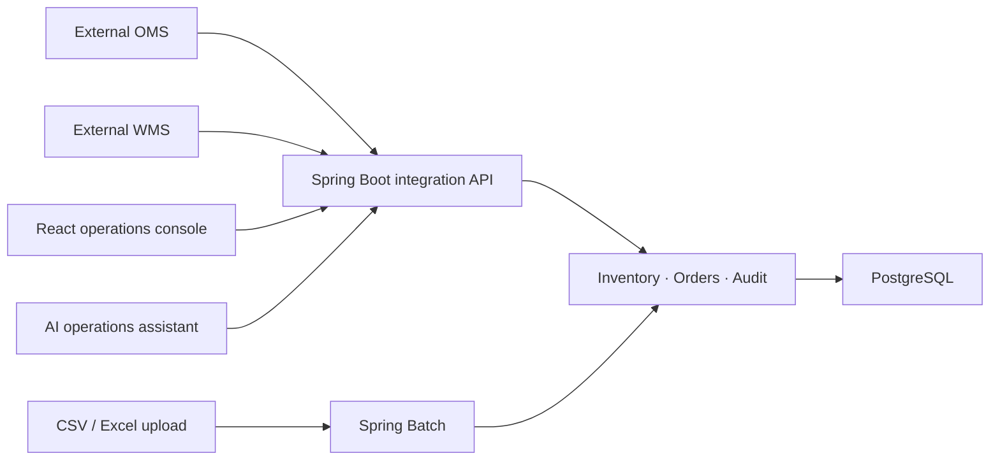

# FORME Operations Hub

F&F 디지털본부 Java/Spring ERP·AI 시스템 직무를 목표로 설계한 글로벌 패션 주문·재고 통합 운영 플랫폼입니다. 고객용 이커머스인 [FORME](https://github.com/khp9798/forme-fashion-commerce)는 그대로 유지하고, 이 프로젝트는 사내 직원이 여러 브랜드·채널·창고의 업무를 처리하는 독립 시스템으로 개발합니다.

## 목표

- Spring Boot 기반 REST API와 React·TypeScript 운영 화면
- 창고·매장·SKU별 재고 및 모든 이동 원장
- 외부 OMS·WMS·ERP 데이터를 받는 대량 배치와 실패 재처리
- 역할별 권한, 승인 흐름과 관리자 감사 로그
- 업무 매뉴얼 RAG와 안전한 AI 조회 도구
- PostgreSQL·Docker·CI/CD·모니터링을 포함한 운영 가능한 구조

## 아키텍처 원칙

처음부터 마이크로서비스로 나누지 않고 **모듈형 모놀리스**로 시작합니다. 주문 연동, 재고, 배치, 감사처럼 업무 경계는 코드에서 분리하지만 하나의 애플리케이션과 트랜잭션으로 개발 복잡도를 낮춥니다. 규모와 조직이 커져 독립 배포가 필요한 모듈만 나중에 분리할 수 있습니다.



## 현재 1단계

- Java 21, Spring Boot 4.1, Gradle
- React 19, TypeScript, Vite
- PostgreSQL 17 개발 컨테이너
- Flyway 초기 스키마: 창고, 상품, SKU, 재고 포지션, 재고 원장, 연동 작업
- Actuator와 시스템 정보 REST API
- 운영 대시보드 첫 화면
- 백엔드·프론트엔드 GitHub Actions 검증

## 로컬 실행

```bash
cp .env.example .env
docker compose up -d postgres

cd backend
JAVA_HOME="$(brew --prefix openjdk@21)" ./gradlew bootRun

cd ../frontend
npm install
npm run dev
```

- API: `http://localhost:8080/api/v1/system/info`
- Health: `http://localhost:8080/actuator/health`
- Web: `http://localhost:5173`

## 다음 구현 순서

1. 창고·매장·SKU 재고 조회와 재고 이동
2. 외부 주문 CSV 업로드 및 검증
3. Spring Batch 청크 처리·실패 격리·재시작
4. 역할 기반 인증과 승인·감사 로그
5. 판매·재고 집계 및 SQL 튜닝
6. RAG 기반 업무 매뉴얼과 AI 조회 도구
